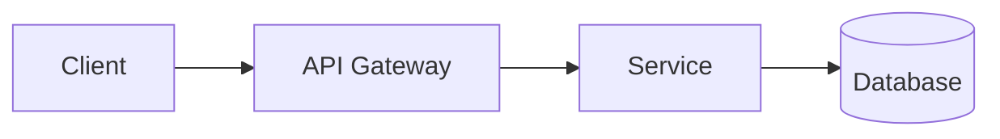

# Documentation

Generate Markdown documentation.

## Sections

1. **Overview** - What it does and why (2-3 sentences)
2. **Architecture** - Mermaid diagram if multi-component
3. **Usage** - Working code examples
4. **Configuration** - Environment variables table
5. **API Reference** - Function signatures with examples (if applicable)

## Templates

### Configuration Table

```markdown
| Variable | Required | Default | Description |
|----------|----------|---------|-------------|
| `DATABASE_URL` | Yes | - | PostgreSQL connection string |
| `LOG_LEVEL` | No | `info` | Logging verbosity |
```

### Mermaid Diagram

```markdown

```

### Function Reference

```markdown
### `create_user(email: str, name: str) -> User`

Create a new user account.

**Parameters:**
- `email` - User email (must be unique)
- `name` - Display name

**Returns:** `User` object

**Raises:** `DuplicateError` if email exists

**Example:**
```python
user = create_user("alice@example.com", "Alice")
```
```

## Output

Markdown only. Explain *why* something exists, not just *what*.
