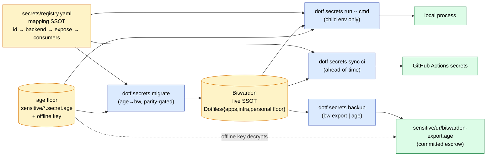
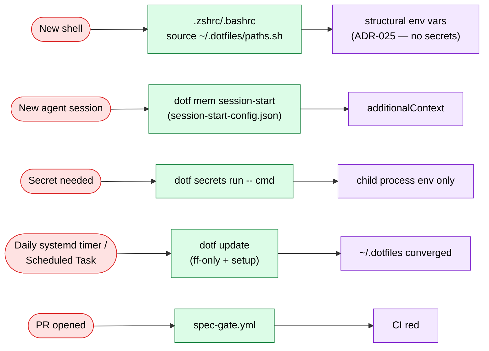
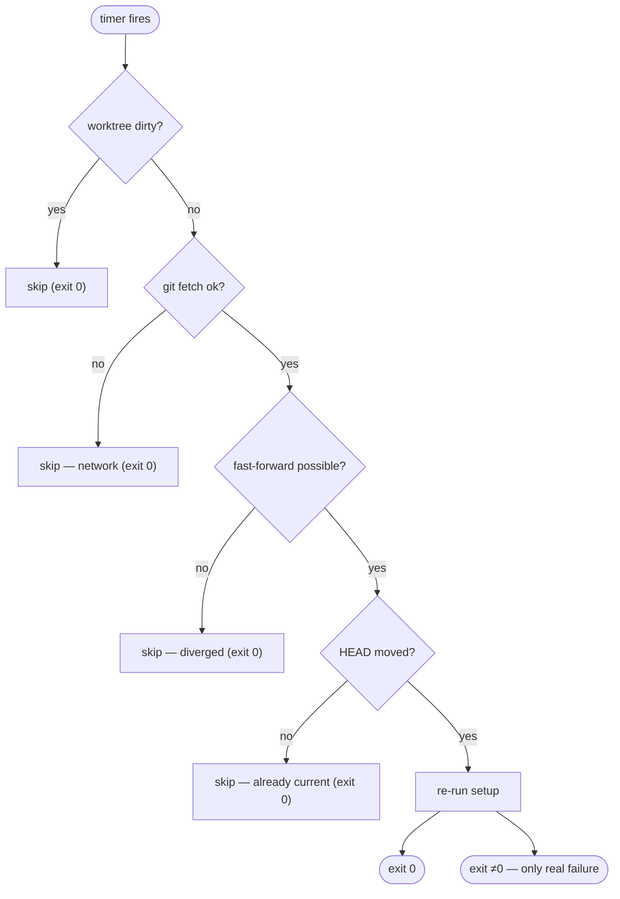

# Documentation audit — 2026-07-07

> Full audit of every reader-facing surface: README, `docs/**` (ADRs, audits, runbooks,
> troubleshooting, lessons, inventory), `specs/README.md`, `cli/README.md`, doc-bearing
> code (CLI help text, config-file comments, module headers, aliases), and all existing
> diagrams. Every accuracy claim was checked against the working tree (`main`, clean, at
> `ccc3189`); the installed `dotf` binary is stale, so CLI claims were verified against
> `cli/internal/**` source. Findings marked **CONFIRMED** were verified by a concrete
> check (quoted in §3); **PLAUSIBLE** means suspected but not fully verified.
>
> Coverage note (verify-don't-assert honesty): all runbooks, all troubleshooting entries,
> `secrets-inventory.md`, `architecture.md`, the architecture map, `specs/README.md`,
> `cli/README.md`, and ADRs 001/002/005/007/008/009/012/013/020/021/024/025/028/029/030/031
> plus AUDIT-003/007 were read line-by-line. ADRs 003/010/011/014/015/017/018/019/022/023/026/027
> and AUDIT-001/002/005/BUG-006 were swept (full-text grep for retired artifacts, status
> fields, supersession markers, and link resolution) rather than line-audited; `lessons.md`
> was audited structurally (headings + sampled entries). No finding below rests on an
> unswept file.
>
> **Companion audits:** `audit-008-codebase-comprehensive.md` (code), `audit-010-process-workflows.md` (process) — same series; see `related:` frontmatter. Vault decide/position layer: `10_projects/dotfiles/research/2026-07-02-project-coherence-audit.md` (external benchmarking + methodology + backlog).

---

## 1. Summary table

| ID | Severity | Document | Issue | Status |
|----|----------|----------|-------|--------|
| D1 | Critical | `README.md` (§Structure, §Human entrypoints, §Key Commands/Secrets, §Sync) | Teaches the retired secrets interface (`secrets_add`…`secrets_check`, `. scripts/load-secrets.sh`) and `dotfiles-sync` with no banner; `dotf secrets` never mentioned | CONFIRMED |
| D2 | Critical | `docs/runbooks/ai-tools-setup.md` | Wholesale stale (ai/skills, ai/gemini, drawio/socket MCPs, claude-mem plugin, `pip install google-generativeai` as "Gemini CLI", `CLAUDE_HOME`, `gp`); no banner; teaches adding skill dirs to the repo — a pattern the README explicitly forbids | CONFIRMED |
| D3 | Critical | `docs/runbooks/guide-knowledge-distillation.md` | Instructs creating vault `11-tasks.md` (directly violates ADR-018 / AGENTS.md); knowledge loop built on retired claude-mem + retired `claude-session-start.{sh,ps1}` scripts | CONFIRMED |
| D4 | Critical | `docs/adr/adr-031` vs `docs/runbooks/guide-bitacora-setup.md` §7a | Direct contradiction on `BITACORA_PAT`: ADR-031 says fine-grained PAT works via github-script GraphQL; the runbook says fine-grained fails even on GraphQL and demands a classic PAT | CONFIRMED (contradiction) |
| D5 | Major | `README.md` | Documented commands don't exist as written: `vault`, `obs`, `dotfiles-sync` (real names `vault.sh`, `obs-cli.sh`, `dotfiles-sync.sh`; `obs` alias absent); "scripts are NOT on PATH" is false | CONFIRMED |
| D6 | Major | `README.md` | Stale counts: "316 BATS tests" (941), "21 custom skills" (34), "~50 scripts" (35), `cli/` "(doctor, init, env, spec)" (11 subcommands) | CONFIRMED |
| D7 | Major | `docs/adr/dotfiles-architecture-map.md` | 2026-05-19 snapshot presented as the orientation map: SSOT list includes `env-mapping.conf`, runtime diagram shows secrets→shell-env (reversed by ADR-028), Layers/Where-does-X-live cite ≥8 retired scripts, `ai/gemini` row, stale counts | CONFIRMED |
| D8 | Major | `cli/README.md` | Documents 2 of 11 subcommands (review, doctor); secrets/env/init/spec/mem/vault/tools/update/version absent | CONFIRMED |
| D9 | Major | `README.md` §AI Tools + `docs/runbooks/guide-opencode-go-setup.md` | OpenCode default model drift: docs say `deepseek-v4-pro` under provider `opencode-go`; deployed config default is `nan/qwen3.6`; `qq` maps to `nan/qwen3.6`, not "qwen3.6-plus". Same fact stated in 3 places, only the config is true | CONFIRMED |
| D10 | Major | `docs/adr/` (statuses) | ADR-009 `proposed` but fully live; ADR-029 `proposed` but shipped (v0.29.0); ADR-002/005 lack "partially superseded by ADR-028/030" banners; ADR-006 lacks the ADR-012 supersession banner; ADR-016 lacks the ADR-026 banner; ADR-021 has stale "(in progress)" markers and its `eval "$(dotf secrets env)"` shim plan was reversed by ADR-028 with no amendment | CONFIRMED |
| D11 | Major | `docs/troubleshooting/ai-tools.md` | Stale sibling of D2: `gp` (now `gpr`), `ai/skills/`, manual drawio/socket `claude mcp add` recovery commands for servers removed 2026-05-25 | CONFIRMED |
| D12 | Major | `docs/troubleshooting/setup-windows-session-hook-path.md`, `docs/runbooks/guide-gemini-cli-recovery.md` | Both are dead weight in the active tree: the first is `status: resolved` and entirely about a retired script; the second self-declares obsolescence ("needed for a few more weeks", sunset 2026-06-18 passed) | CONFIRMED |
| D13 | Major | `docs/secrets-inventory.md` | 2026-06-25/28 working snapshot at `docs/` root with no historical banner; ADR-030 makes `secrets/registry.yaml` the SSOT it seeded; readers can mistake the table for live state; the re-added `sensitive/env-mapping.conf` split-brain (#669) is documented nowhere reader-facing | CONFIRMED |
| D14 | Major | `.zsh/aliases.zsh:32` | Alias `cl` → `changelog-gen.sh` which no longer exists (retired to release-please, CLI-011) — broken doc-bearing code | CONFIRMED |
| D15 | Major | `tmux.conf:2`, `docs/runbooks/guide-tmux.md` §deploy, arch-map | All three say `~/.tmux.conf` is a **symlink**; setup deploys it by **copy** (`deploy_file`, ADR-012). Contradicts the repo's own deploy ADR | CONFIRMED |
| D16 | Major | `AGENTS.md:31` | "37 universal patterns in `00_meta/patterns/`" — the vault dir has 72 files | CONFIRMED |
| D17 | Major | `specs/README.md:24-26` | "archive contains ~44 specs … active tree ~26" — real: 75 archived, 57 active (dated "as of 2026-06" but 2× off a month later; a count that structurally rots) | CONFIRMED |
| D18 | Major | 3 dead relative links | `adr-026` → `pattern-knowledge-placement` (vault note linked as repo-relative path); `hive-mcp-rejection-disconnect.md` → `claude-mem-broken-marketplace.md` (moved to `archive/`); `archive/claude-mem-broken-marketplace.md` → `ai-tools.md` (missing `../`) | CONFIRMED |
| D19 | Minor | `env-contract.json` `_comment`+`DOTFILES_DIR` descr., `session-start-config.json` `doctor_drift` comment | Reference retired `doctor.{sh,ps1}` / `healthcheck` as consumers | CONFIRMED |
| D20 | Minor | `docs/adr/adr-012` (Consequences) | Cites a `dot` alias as the retraining mitigation — no such alias exists in any profile | CONFIRMED |
| D21 | Minor | `README.md` §Quick Start vs ADR-005 | Quick start clones the repo *into* `~/.dotfiles`; the two-directory model defines `~/.dotfiles` as the deploy target that is "never modified directly" and the repo home as `~/Projects/dotfiles` (also the `env-contract.json` default). Two onboarding stories | CONFIRMED (doc conflict; runtime behavior of repo==deploy not tested) |
| D22 | Minor | `docs/README.md` | Index omits `architecture.md` and `secrets-inventory.md`; no audience/task routing ("I want to change X → read Y") | CONFIRMED |
| D23 | Minor | `docs/lessons.md` | 1,462-line append-only log with no TOC/topic index; a maintainer hunting one lesson can only grep | CONFIRMED |
| D24 | Minor | `docs/runbooks/guide-opencode-go-setup.md` | 247 lines: one-time setup + billing guardrail + ~140 lines of deep troubleshooting/latency forensics in one doc; references `specs/AI-011-opencode-bootstrap/` (no longer in the active tree) | CONFIRMED (spec path: PLAUSIBLE archived) |
| D25 | Minor | `docs/adr/adr-007` | MCP table (drawio/socket global servers) predates the 2026-05-25 removal; no pointer to `mcp-servers.json` `_history` as the current record | CONFIRMED (historical record; banner missing) |
| D26 | Minor | `docs/adr/audit-007-cli-convergence-state.md` | `status: active` frontmatter on a dated snapshot whose plan is now half-executed (secrets/mem/update shipped since 2026-06-20) | CONFIRMED |
| D27 | Minor | `docs/architecture.md:27` | `.zsh/` described as "(aliases, completions)"; contents are aliases + functions + nvm, no completions module | CONFIRMED |
| D28 | Minor | `docs/runbooks/secrets-management.md`, `docs/troubleshooting/secrets.md` | Both carry correct "out of date, pending #600" banners (good), but the bodies still walk retired commands step-by-step; the SSH/backup/USB sections (still valid) are trapped inside a legacy doc | CONFIRMED |

Verified-accurate surfaces worth naming (one line each, per the "one line where they lead with truth" rule): `guide-self-deploy-timer.md` (all commands verified incl. `dotf update` + `DOTFILES_AUTODEPLOY` tri-state), `guide-secrets-governance.md` (`dotf secrets backup` exists: `cli/internal/cmd/secrets_backup.go`), `guide-antigravity-cli-migration.md`, `guide-bitacora-setup.md` (except D4), the two hive-MCP troubleshooting notes (model citizens: explicit retire-criteria sections), `copilot-cli-v1-vs-v2-detection.md`, ADR-020/024/025/028/030/031, `machine.json.example`, `versions.conf` comments, `mcp-servers.json` `_comment`/`_history`, `git-hooks/pre-commit` header, systemd unit descriptions, `setup-{linux,windows}` headers, README's tmux quick block (all binds verified against `tmux.conf`), README's shell-helpers block (all 6 functions exist), `.zshrc.local.example`/`.bashrc.local.example`, `install-precommit.sh --with-sdd-gate`, `hc`/`dch` wrappers.

---

## 2. Documentation map — current vs proposed

### Current

| Surface | Purpose (claimed) | Audience | Found via | State |
|---|---|---|---|---|
| `README.md` (252) | Entry point: quick start, features, commands | Newcomer + returning maintainer | GitHub landing | Structure good; §Secrets/§Sync/§entrypoints teach a retired interface (D1/D5/D6) |
| `docs/README.md` (10) | docs/ index | Anyone routed into docs/ | README §Documentation | Incomplete index (D22) |
| `docs/architecture.md` (78) | Normative repo tree ("where does X live"), CI-guarded | Maintainer/agent orienting | README + AGENTS.md | Accurate (guarded by `architecture-md.bats`); one cosmetic row (D27) |
| `docs/adr/` 31 ADRs + 6 audits + map | Decision record | Maintainer/agent | architecture.md, cross-links | Recent ADRs excellent; status/banner hygiene inconsistent (D10); map badly stale (D7) |
| `docs/runbooks/` (11) | Operational procedures | Operator (often future-you) | docs/README | 5 current+verified, 2 legacy-with-banner, 2 critically stale (D2/D3), 1 obsolete (D12), 1 oversized (D24) |
| `docs/troubleshooting/` (6+2 archived) | Symptom→cause→fix | Operator mid-incident | runbook cross-links | hive/copilot entries exemplary; ai-tools stale (D11); one resolved entry unarchived (D12) |
| `docs/lessons.md` (1,462) | Append-only gotcha log | Maintainer + agents | AGENTS.md Standing Order #3 | Healthy discipline, no index (D23) |
| `docs/secrets-inventory.md` (100) | Migration working artifact | Migration executor (past) | ADR-028 reference | Snapshot without banner (D13) |
| `specs/README.md` (34) | SDD workspace explainer | Contributor hitting spec-gate | spec-gate failure links | Good; stale counts (D17) |
| `cli/README.md` (88) | dotf CLI overview | CLI contributor | cli/ tree | 2/11 commands (D8) |
| Doc-bearing code | help text, config comments, headers | All | — | dotf help text excellent; a few retired-script mentions (D19); aliases file has one broken entry (D14) |
| `specs/**/quickstart.md` | (in audit scope) | — | — | None exist — scope item is empty, not a gap |
| CONTRIBUTING/onboarding | — | External contributor | — | No file; README §Contributing (5 lines) covers the spec-gate contract — adequate for a solo repo |

### Proposed (executable by a maintainer)

1. **`README.md` — rewrite three sections in place** (no split needed; 252 lines is right):
   - §Key Commands/Secrets → `dotf secrets {run,show,set,verify,ls,backup}` with one `run --` example; link `guide-secrets-governance.md`.
   - §Human entrypoints → real names (`vault.sh`, `obs-cli.sh`, `dotfiles-sync.sh`), correct the PATH claim, add `dotf update`/`dotf tools`; drop the load-secrets row.
   - §Structure + §Features → drop hand-counted numbers ("316 tests", "21 skills", "~50 scripts") or state them as ranges; list the full `dotf` noun set.
2. **`docs/runbooks/ai-tools-setup.md` → replace**, splitting by audience:
   - `guide-agent-provisioning.md` — what setup deploys per agent today (claude/agy/copilot/opencode/pi/hermes/nan), MCP registration from `mcp-servers.json`, plugin list from `ai/claude/settings.json`. Reference mode.
   - Skills pipeline how-to → already exists as vault pattern + README §AI-skills paragraph; the runbook only needs a pointer, not a copy (SSOT).
3. **`guide-knowledge-distillation.md` → rewrite around the current loop** (`dotf mem session-start`/`session-end`, `session-start-config.json`, Hive, `/crystallize`), delete the claude-mem diagram and the `11-tasks.md` instruction; the cross-machine-sync half (§Cross-Machine Memory Sync onward) is current and could stand alone as `guide-memory-sync.md` — the two halves serve different tasks (weekly hygiene vs new-machine wiring).
4. **Secrets doc triangle → one canonical home**: `guide-secrets-governance.md` stays the operational SSOT; fold the still-valid parts of `secrets-management.md` (SSH key deploy, USB/VeraCrypt backup, restore) into it (or into a slim `guide-age-floor.md`) and delete the legacy walkthrough (#600); move `secrets-inventory.md` → `docs/adr/audit-008-secrets-inventory.md`-style dated artifact or `specs/archive/`, and add one paragraph on the #669 env-mapping split-brain until it's resolved.
5. **Archive mechanics**: create `docs/runbooks/archive/` (mirroring troubleshooting) and move `guide-gemini-cli-recovery.md`; move `setup-windows-session-hook-path.md` → `docs/troubleshooting/archive/`.
6. **`guide-opencode-go-setup.md` → split**: keep setup+guardrail (~100 lines); move the stall/latency/cwd forensics to `docs/troubleshooting/opencode.md`.
7. **`cli/README.md`**: add a one-line-per-subcommand table (11 rows) pointing at `dotf <cmd> --help`; keep the review/doctor deep sections.
8. **`docs/README.md`**: index all direct children + a 6-row task-routing table; link the architecture map with an explicit "dated snapshot" caveat (or retire the map per D7).
9. **`dotfiles-architecture-map.md`**: either regenerate (AUDIT-004 pattern, new date) or stamp `status: superseded-snapshot` and point orientation readers at `docs/architecture.md`. Its two diagrams are worth regenerating (see §5).
10. **ADR hygiene batch** (one PR): flip ADR-009 → accepted, ADR-029 → accepted; add supersession/amendment banners to ADR-002/005/006/016/021 (ADR-001/008/014 already model the pattern); demote `audit-007` frontmatter to a dated-snapshot status.
11. **`docs/lessons.md`**: add a generated TOC (or `## Index by topic` block) at top; keep append-only body.

---

## 3. Drift verification (claim → check → result)

Every CONFIRMED accuracy finding, with the exact check run:

| # | Claim (doc:line) | Check run | Result |
|---|---|---|---|
| 1 | `scripts/load-secrets.sh / .ps1` exists (README:54,94) | `ls scripts/` | 35 files, no `load-secrets.*` — **gone** |
| 2 | `secrets_add`/`secrets_rotate`/`secrets_show`/`secrets_list`/`secrets_check`/`secrets_add_file` (README:101-106; secrets-management.md; troubleshooting/secrets.md) | `grep -rn "secrets_add\|secrets_rotate\|…" .zsh/ .bashrc powershell/ scripts/` | No definitions anywhere — functions retired |
| 3 | "316 BATS tests" (README:44) | `grep -c "^@test" tests/*.bats \| awk` | **941** tests across 62 files |
| 4 | "21 custom skills" (README:41; ai-tools-setup.md:19) | `ls harness/skills \| wc -l` | 34 skill dirs (+ATTRIBUTION.md) |
| 5 | "~50 scripts total" (README:56) | `ls scripts/ \| wc -l` | 35 |
| 6 | `cli/` = "(doctor, init, env, spec)" (README:51) | `ls cli/internal/` + `dotf --help` | 12 packages / 11 user subcommands: doctor, env, init, mem, review, secrets, spec, tools, update, vault, version |
| 7 | "Scripts in scripts/ are **not on PATH**" (README:81) | `grep -n PATH .zshrc .bashrc` | `.zshrc:93` `PATH="$DOTFILES_DIR/scripts:$PATH"`, `.zshrc:153` `PATH="$HOME/.dotfiles/scripts:$PATH"` (same in `.bashrc`) — **on PATH** |
| 8 | `vault <subcommand>` / `obs` / `dotfiles-sync` commands (README:91-93,152) | `grep -nE "alias (vault\|obs\|dotfiles-sync)=" .zsh/ .zshrc .bashrc` + `ls scripts/` | No aliases; scripts are `vault.sh`, `obs-cli.sh`, `dotfiles-sync.sh` — commands as written fail (only `alias obsidian='obsidian --no-sandbox'` exists) |
| 9 | `oc` default "DeepSeek V4 Pro" (README:139); "Default model: deepseek-v4-pro (set in opencode.jsonc)" (guide-opencode:81) | `grep -n model ai/opencode/opencode.jsonc` | `"model": "nan/qwen3.6"` (line 34); provider renamed `opencode-go` → `nan` |
| 10 | `qq` → "qwen3.6-plus" (README:140) | `.zsh/aliases.zsh:44` | `alias qq='noglob _qq_call nan/qwen3.6 qq'` |
| 11 | `cl` alias → `changelog-gen.sh` (aliases.zsh:32) | `ls scripts/changelog-gen.sh` | No such file |
| 12 | tmux.conf "Deployed … via setup-linux.sh **symlink**" (tmux.conf:2; guide-tmux §deploy `ln -sf`; arch-map:169) | `grep -n tmux setup-linux.sh` | `setup-linux.sh:94 deploy_file "$DOTFILES_DIR/tmux.conf" "$HOME/.tmux.conf"` — copy, per ADR-012 |
| 13 | Arch-map Foundation/Health/Secrets/Hooks layers cite `load-secrets.sh`, `healthcheck.sh`, `doctor.sh`, `diff-check.sh`, `claude-session-start.*`, `claude-mem-heal.*`, `init-project.*`, `github-secrets-manager.sh`, `skills-to-opencode.sh` | `ls scripts/` | None of the nine exist — retired into `dotf` (doctor/init/mem/secrets/update per `cli/internal/`) |
| 14 | Arch-map "five SSOTs" incl. `sensitive/env-mapping.conf`; "Add a secret → env-mapping.conf + secrets_add_file" (arch-map:14,154) | `ls secrets/` + ADR-030 | `secrets/registry.yaml` is the mapping SSOT; env-mapping.conf exists only as the #669 split-brain re-add |
| 15 | ADR-029 `status: proposed` (frontmatter) | `dotf secrets --help` lists `sync`; ADR-028 §Ratification: "sync/verify … shipped (#612 Phase B, v0.29.0)"; `cli/internal/cmd/secrets_sync.go` exists | Shipped — status stale |
| 16 | ADR-009 `status: proposed` | AGENTS.md header ("Single Source of Truth"); every per-agent file delegates; `tests/agents-md.bats` guards it | Fully implemented — status stale |
| 17 | ADR-012 "`dot` alias opens $DOTFILES_DIR" | `grep -rn "alias dot=" .zsh/ .zshrc .bashrc powershell/` | No match |
| 18 | AGENTS.md "37 universal patterns" (AGENTS.md:31) | `ls $VAULT/00_meta/patterns \| wc -l` | 72 files |
| 19 | specs/README "~44 archived / ~26 active" | `ls -d specs/*/ \| grep -v archive \| wc -l`; `ls -d specs/archive/*/ \| wc -l` | 57 active / 75 archived |
| 20 | ai-tools-setup: setup copies `ai/skills/*`, `ai/gemini/*`; MCPs drawio+socket; claude-mem essential plugin; `g`→gemini, `gp` function | `ls ai/` (no skills/, no gemini/); `mcp-servers.json` `_history` ("removed drawio … socket", servers = seq-thinking/context7/hive); CHANGELOG #645 ("complete claude-mem retirement"); `.zshrc:116 alias g='agy'`; `gp` undefined (`gpr` in functions.sh:167) | All five drifted |
| 21 | ai-tools-setup "until a Windows dotf install path exists (#380)" | `command -v dotf` on this Windows box + AUDIT-007 corrected-fact #1 | dotf installed via `install-dotf.ps1` (WIN-006) — claim stale |
| 22 | `CLAUDE_HOME` env var (ai-tools-setup:268) | `env-contract.json` CLAUDE_CONFIG_DIR description | Contract says canonical var is `CLAUDE_CONFIG_DIR`, "intentionally NOT renamed" — doc contradicts contract |
| 23 | guide-knowledge-distillation §new-project: create `11-tasks.md — active backlog` | AGENTS.md Knowledge Placement ("The vault no longer holds task state (no 11-tasks.md)"); guide-bitacora §1 | Direct contradiction with ADR-018 doctrine |
| 24 | BITACORA_PAT type: ADR-031:23 "a **fine-grained PAT**" + workflows-work-via-github-script vs guide-bitacora:151-155 "must be a **classic** PAT … fine-grained … both add-to-project and the Projects v2 GraphQL (§7b) fail" | Read both (quoted); both dated 2026-06-25/26 | Mutually exclusive claims; unresolvable from docs alone (open question Q1) |
| 25 | `dotf secrets backup` described as shipped (guide-secrets-governance §BACKUP) | `ls cli/internal/cmd/secrets_backup.go cli/internal/secrets/escrow.go` | Exists — runbook accurate (note: ADR-028 §Ratification still says "not yet built", now stale by #661) |
| 26 | guide-self-deploy-timer: `dotf update`, `DOTFILES_AUTODEPLOY`, unit names | `systemd/dotfiles-selfupdate.service:14 ExecStart=%h/.local/bin/dotf update`; `grep DOTFILES_AUTODEPLOY setup-*.{sh,ps1}` | All verified accurate |
| 27 | README tmux binds (`C-b` prefix, h/j/k/l, `%`/`"` splits, `r` reload) | `grep -nE "^bind\|prefix" tmux.conf` | All present; no prefix remap — accurate |
| 28 | README shell helpers (mkd, gz, dataurl, targz, server, getcertnames) | `grep -nE "^[a-z_]+\(\)" .zsh/functions.sh` | All six exist — accurate |
| 29 | env-contract `_comment` "read by … the legacy doctor.{sh,ps1}"; session-start-config `doctor_drift`: "via scripts/doctor.{sh,ps1}" | `ls scripts/doctor.sh` | Gone (dotf doctor `--quick` is the real runner per its help text) |
| 30 | Dead links | Link-resolver script over all md (relative links → `realpath -m` → `-e` test), false positives manually disproved (audit-003's `../AGENTS.md` is inside a quoted diff — discarded) | 3 real: adr-026→`pattern-knowledge-placement`; hive-mcp-rejection-disconnect→`claude-mem-broken-marketplace.md`; archive/claude-mem-broken-marketplace→`ai-tools.md` |

---

## 4. Findings by hunt category

### 4.1 Drift / inaccuracy (primary)

**D1 — README teaches a secrets interface that no longer exists. CONFIRMED, Critical.**
Reader scenario broken: a newcomer (or an agent using the README as spec) needs to add a
secret; they run `secrets_add MY_TOKEN my.token` → `command not found`; nothing in the
README names `dotf secrets`, so there is no recovery path from this doc. Checks §3 #1-2, #8.
Direction: rewrite §Key Commands/Secrets around `dotf secrets` + registry; fix the
entrypoints table; add `dotf secrets` to §Structure's `cli/` line. The runbooks got
banners (#600) — the README, the highest-traffic surface, never did.

**D2 — `ai-tools-setup.md` describes a system that was dismantled. CONFIRMED, Critical.**
Scenario: an operator provisions a new machine for AI tools; they create `ai/skills/api/`
per §Adding a New Skill (the README explicitly forbids repo skill dirs; the harness
pipeline ignores them), `pip install google-generativeai` expecting a CLI, register
drawio/socket MCPs that setup removed on purpose, and look for the claude-mem plugin
retired in #645. Checks §3 #20-22. Direction: replace per §2 proposal 2; until then a
top banner like secrets-management.md's is the 5-minute stopgap.

**D3 — knowledge-distillation runbook contradicts ADR-018. CONFIRMED, Critical.**
Scenario: maintainer starts a new project; §"What to do when starting a new project"
step 1 says create `11-tasks.md — active backlog` in the vault — the exact anti-pattern
ADR-018/AGENTS.md abolished, and guide-bitacora (same folder) declares forbidden. An agent
following this runbook re-introduces vault task state. The loop diagram routes through
retired claude-mem. Check §3 #23. Direction: §2 proposal 3.

**D5/D6 — README command names & counts. CONFIRMED, Major.** Checks §3 #3-8. Notably the
"NOT on PATH" claim inverts reality — the *reason* the alias-less script names work at all.

**D7 — architecture map. CONFIRMED, Major.** It carries the two best diagrams in the repo
and is recommended as first-read orientation, but both diagrams and 3 of its 4 tables
describe the pre-ADR-028/pre-strangler world (checks §3 #12-14). A dated header is not
enough when the doc is actively routed to as current ("Read first when orienting").
Direction: regenerate or demote (§2 proposal 9).

**D9 — OpenCode model facts triplicated and all stale except the config. CONFIRMED, Major.**
Check §3 #9-10. Direction: docs state "default lives in `ai/opencode/opencode.jsonc`"
and name models only as examples.

**D10 — ADR status/banner hygiene. CONFIRMED, Major.** Checks §3 #15-17. The repo already
has the right convention (ADR-001/008 carry "supersession proposed by ADR-013" banners;
ADR-014 carries a superseded note; ADR-020 an Amendment) — it's applied inconsistently.
An agent reading ADR-002/005 today learns an ambient-export model that ADR-028 reversed.

**D11-D15, D19-D21, D25-D28** — itemized in §1 with checks in §3; all follow the same
class: the code moved (strangler-fig, secrets redesign, agy migration) and the paper trail
lagged on exactly the surfaces without CI guards.

### 4.2 Inverted-pyramid violations

Mostly healthy — README, ADRs (decision-first), runbooks (what-it-does first), and
troubleshooting (symptom→cause→fix) all open correctly. Two exceptions:

- **`secrets-management.md`**: after the banner, the first 100 lines walk the *retired*
  architecture before any current fact appears (the one live section, `dotf secrets sync
  ci`, is buried mid-document at line 88). A reader skimming past the banner learns the
  wrong 80% first.
- **`guide-knowledge-distillation.md`**: opens with philosophy/token-cost rationale for
  ~35 lines before any actionable step; the "what do I actually run" (crystallize/insights
  cadence table) sits at line 176.

### 4.3 Sizing / decomposition

- **Split — `guide-opencode-go-setup.md` (247)**: setup/guardrail vs. deep troubleshooting
  (stall forensics, cwd analysis, latency benchmarks). Reader task defeated: mid-incident
  "why does my stream stall" requires scrolling past billing setup; conversely first-time
  setup readers hit 140 lines of failure lore. → `troubleshooting/opencode.md` (§2 prop. 6).
- **Split — `guide-knowledge-distillation.md` (385)**: weekly-hygiene loop vs.
  cross-machine memory-sync reference; the sync half is current and useful, the loop half
  is stale — splitting also isolates the rewrite (§2 prop. 3).
- **Merge — secrets triangle**: `guide-secrets-governance.md` (canonical) + the still-valid
  age-floor/USB/SSH mechanics stranded in `secrets-management.md` + the historical
  `secrets-inventory.md` (§2 prop. 4).
- **Merge/absorb — `tool-installation.md` (197)**: hand-listed install commands + version
  pins that duplicate `versions.conf` (`sdk install java 21.0.1` vs pin `21.0.4`) and
  ignore `packages.json`/`dotf tools install` (CLI-029) — the repo's own answer to this
  doc. Direction: shrink to "setup installs most things; `dotf tools list/install` for the
  catalog; here's what needs manual sudo (tmux, xclip, docker)". Rationale to keep: brew/mac
  lines serve the planned macOS port — keep them in one "manual installs" appendix.
- **`lessons.md` (1,462)**: keep as one log (append-only is the value), fix findability
  with an index (D23) — no split needed.

### 4.4 Architecture as drawn process

Only 3 Mermaid/ASCII diagrams exist in reader docs: the two in the (stale) architecture
map and one ASCII loop in knowledge-distillation (stale) + small ASCII trees (deploy
chain in guide-tmux — wrong per D15; sync flow in ADR-007). The current-era decisions
(ADR-028/029/030 secrets, ADR-025 cascade, dotf update lifecycle) are prose-only.
See §5 backlog + drafts.

### 4.5 Usefulness / audience fit

- The **hive troubleshooting pair** and **guide-self-deploy-timer** are the gold standard:
  scoped symptom, verified commands, explicit retire-criteria.
- **`tool-installation.md`** and post-rewrite **`ai-tools-setup.md`** currently serve
  nobody end-to-end (both predate the automation that replaced their steps).
- Mode-mixing: `guide-opencode-go-setup` mixes how-to + reference + troubleshooting
  (§4.3); `guide-bitacora-setup` deliberately mixes reference (IDs) + how-to and it
  *works* — no change needed there.
- Newcomer zero-to-first-success: Linux quick start works (clone → setup → new shell);
  but the first secrets task fails (D1) and the D21 clone-location ambiguity means a
  newcomer who later becomes a contributor has their repo in the "wrong" place per
  ADR-005. One clarifying sentence in Quick Start fixes it.

### 4.6 Coverage — see §6 for the backlog

Headlines: 7 of 11 `dotf` subcommands are absent from every prose doc (only `--help`
covers them); `dotf secrets backup` is documented solely inside the governance runbook;
the #669 env-mapping split-brain has no reader-facing note; no troubleshooting entry
exists for `dotf update` failures (the runbook's diagnose table covers the happy skips)
or for `bw` unlock friction.

### 4.7 Single source of truth

- **BITACORA_PAT type** (D4) — the sharpest instance: two authoritative-looking docs,
  opposite claims, both load-bearing at rotation time.
- **OpenCode default model** (D9) — stated in 3 places; only the config is real.
- **Counts** (D6/D17/D16) — test/skill/script/spec/pattern counts hand-copied into prose
  rot on every merge. Direction: remove precise counts from prose, or guard them (the
  repo's own incident→guard pattern; `architecture-md.bats` proves the approach works).
- **Version pins** — `tool-installation.md` duplicates `versions.conf` values (§4.3).
- **Terminology** — "two-tier deploy" vs "two-directory sync" refer to the same thing
  across README/ADR-005/arch-map/guide-tmux; pick one term and alias the other once.

### 4.8 Findability / navigation

- `docs/README.md` (10 lines) under-routes: no `architecture.md`, no inventory, no
  audits dir, no task-based routing (D22).
- Orphans: `secrets-inventory.md` (only inbound links from ADR-028 §references) and the
  architecture map (linked as "read first" from maintainer memory but not from
  `docs/README.md`).
- Dead links: 3 (D18).
- Cross-link quality is otherwise high — ADR↔runbook↔troubleshooting references are dense
  and mostly resolve.

---

## 5. Diagram backlog (value order)

1. **Secrets two-tier architecture + command flows** → new section in
   `guide-secrets-governance.md` (and referenced from ADR-028). The single most
   prose-locked architecture in the repo (ADR-028 §Decision + §Phased plan + ADR-029/030).

2. **Runtime data-flow refresh** → replaces the stale diagram in the architecture map
   (or lives in `docs/architecture.md`). Key correction: no secrets at shell startup;
   session hooks via `dotf mem`.

3. **`dotf update` self-deploy lifecycle** → `guide-self-deploy-timer.md` (its skip
   ladder is a textbook state flow).

4. **ADR-025 path-resolution cascade** → README §Cross-machine paths or ADR-025
   (`env var → machine.json → env-contract default → dotf env generate → paths.{sh,ps1}
   → shells/hooks/CLI`). Flowchart; ~8 nodes; replaces three prose paragraphs.
5. **ADR-030 registry read/write asymmetry** → ADR-030 (sequence diagram: `migrate`
   writes checkout-only fail-loud; reads checkout-first-fallback-deployed) — the bug it
   fixed is subtle enough that the prose takes 3 readings.
6. **Bitácora status lifecycle** → guide-bitacora §5 (stateDiagram: Backlog→In
   Progress→Blocked→Done with the automation labels).

Stale diagrams to fix/retire: the two in `dotfiles-architecture-map.md` (setup-time one
is refreshable — its shape is right, its labels stale; runtime one → replace with #2),
the knowledge-loop ASCII in guide-knowledge-distillation (claude-mem era), the deploy
chain in guide-tmux (symlink step wrong, D15).

---

## 6. Missing-docs backlog (by unblocking value)

1. **README secrets section rewrite** (D1) — unblocks the single most common operator
   task; every day it stands it mis-trains agents reading the repo as spec.
2. **`dotf` subcommand coverage**: a table in `cli/README.md` (11 rows) + README
   §Structure line fix. `mem`, `vault`, `tools`, `update`, `version` currently exist
   only in `--help`.
3. **env-mapping split-brain note** (#669): one paragraph in `guide-secrets-governance.md`
   ("`sensitive/env-mapping.conf` re-appeared via #659; registry.yaml is authoritative;
   removal tracked in #669") — prevents a reader from 'fixing' either side ad hoc.
4. **`troubleshooting/opencode.md`** (from the D24 split) + a stub
   **`troubleshooting/dotf-update.md`** (non-skip failures: setup errored mid-run,
   binary self-replace on Windows).
5. **Agent-provisioning reference** (replacement for ai-tools-setup, §2 prop. 2).
6. **BITACORA_PAT resolution** (D4): once Q1 below is answered, one doc wins and the
   other links to it.
7. **`docs/README.md` routing table** (D22) + lessons.md index (D23).
8. **Onboarding clarification** (D21): one sentence in README Quick Start distinguishing
   "user install" (clone anywhere, setup deploys to `~/.dotfiles`) from "contributor
   layout" (`~/Projects/dotfiles` per env-contract default).
9. **ADR-013/harness engine status note**: `compile-harness.sh` ships the engine's shell
   form while ADR-013 stays `proposed` and CLI-026 is an active spec — one status line in
   ADR-013 ("shell implementation live; Go port = CLI-026") would stop readers from
   re-deriving this. (PLAUSIBLE — status intent may be deliberate pending the Go port.)
10. **macOS placeholder**: README already handles it well; when `setup-macos` lands,
    Requirements + platform table already have slots — nothing needed now.

---

## 7. Open questions (maintainer-only)

- **Q1 (D4)**: Which BITACORA_PAT claim is true today — is the live token classic or
  fine-grained? ADR-031 (2026-06-26) and guide-bitacora §7a gotcha (2026-06-25) cannot
  both be right about the GraphQL path. The answer decides which doc gets corrected.
- **Q2 (D7)**: Architecture map — regenerate as AUDIT-00x-2026-07 snapshot, or retire in
  favor of `docs/architecture.md` + the §5 diagrams? (It's the only doc with the full
  deploy-target fan-out; losing it un-regenerated loses real content.)
- **Q3 (D13)**: `secrets-inventory.md` — archive as dated artifact, or keep alive as a
  generated view over `registry.yaml` (`dotf secrets ls` output + bw cross-section)?
- **Q4 (D6/D16/D17)**: For rotting counts, prefer removal ("dozens of skills") or a CI
  guard that greps the number against reality (the repo's incident→guard doctrine argues
  for guards, but each guard adds maintenance)?
- **Q5 (D21)**: Is clone-into-`~/.dotfiles` actually supported by `setup-linux.sh`
  (repo == deploy dir)? If yes, ADR-005 deserves a note; if no, the README quick start
  is teaching a broken layout and needs the two-directory story.
- **Q6**: `docs/runbooks/archive/` does not exist — is frontmatter `status: archived`
  (hive-mcp note's plan) the preferred retirement mechanism over a directory move?
  Troubleshooting uses a directory; pick one convention.
