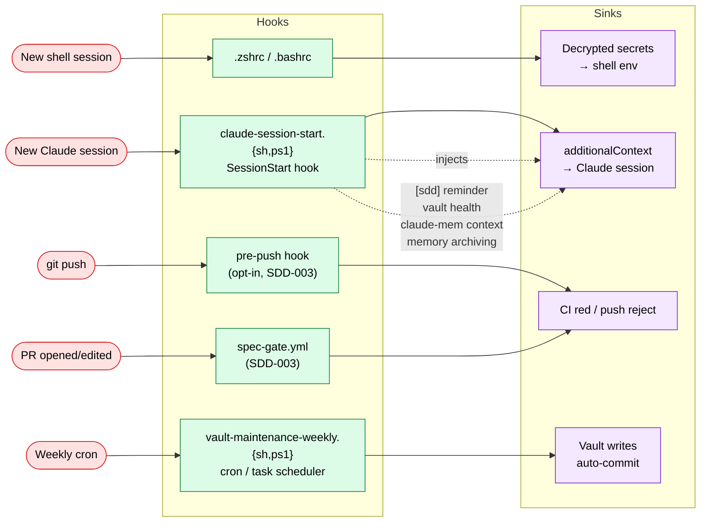

# Dotfiles Architecture Map

> ⚠️ **Superseded snapshot, frozen as of 2026-05-19.** For current orientation ("where
> does X live") read [`docs/architecture.md`](../architecture.md) instead — it is
> CI-guarded (`tests/architecture-md.bats`) and stays in sync with the tree. This map's
> SSOT list, runtime diagram, and layer tables predate ADR-028 (secrets redesign) and
> much of the strangler-fig CLI convergence (ADR-020/021); they describe the repo as it
> was, not as it is. Kept for historical reference — content below is intentionally
> **not** updated in place. The corrected runtime data-flow diagram lives in
> `docs/architecture.md`; the corrected secrets flow lives in
> [`guide-secrets-governance.md`](../runbooks/guide-secrets-governance.md).

> Current-state snapshot of the `dotfiles` repo. Baseline for AUDIT-001 (repo structure), AUDIT-002 (cross-OS duplication), AUDIT-003 (docs drift). Generated 2026-05-19 (AUDIT-004).

## TL;DR

`setup-{linux.sh,windows.ps1}` are the two entry points; everything else fans out from them. The repo is a **two-tier deploy** (`repo → ~/.dotfiles → ~/ symlinks`) with **five SSOTs at the root** (`AGENTS.md`, `versions.conf`, `env-contract.json`, `mcp-servers.json`, `sensitive/env-mapping.conf`) feeding **specialized scripts** that write to **six deploy targets** (`~/.dotfiles`, `~/`, `~/.claude`, `~/.gemini`, `~/.copilot`, `~/.config/opencode`).

## Inventory (2026-05-19)

| Surface | Files | LOC |
|---|---:|---:|
| `*.sh` (scripts/, root, .github/hooks) | 31 | 7 663 |
| `*.ps1` (scripts/, root, powershell/) | 17 | 4 060 |
| `*.bats` (tests/) | 33 | 4 434 |
| `*.md` (specs/, ai/, root, .github/) | 55 | 10 992 |
| **Total tracked** | ~170 | ~27 000 |

13 top-level directories. 13 tracked root-level files. 31 compiled skill records under `harness/skills/` (sourced from the vault SSOT `00_meta/skills/`).

## Setup-time data flow

```mermaid
flowchart TB
    classDef ssot fill:#fef3c7,stroke:#d97706,color:#000
    classDef entry fill:#dbeafe,stroke:#1e40af,color:#000
    classDef script fill:#dcfce7,stroke:#15803d,color:#000
    classDef target fill:#f3e8ff,stroke:#7e22ce,color:#000

    USER([User runs setup-linux.sh<br/>or setup-windows.ps1]):::entry

    subgraph SSOTs ["Root SSOTs"]
        AGENTS["AGENTS.md<br/>cross-agent prompt"]:::ssot
        VC["versions.conf<br/>tool versions"]:::ssot
        ENV["env-contract.json<br/>structural env vars"]:::ssot
        MCP["mcp-servers.json<br/>MCP registry"]:::ssot
        EMAP["sensitive/env-mapping.conf<br/>secret→env"]:::ssot
    end

    subgraph FOUNDATION ["Foundation libs"]
        UTILS["scripts/utils.sh<br/>726 LOC, sourced by all .sh"]:::script
        MERGE["Merge-ClaudeSettings<br/>merge_claude_settings<br/>(SDD-002 helpers)"]:::script
    end

    subgraph TARGETS ["Deploy targets"]
        DOT["~/.dotfiles/<br/>two-tier intermediate"]:::target
        HOME["~/ symlinks<br/>.zshrc .bashrc .profile<br/>.tmux.conf .gitconfig"]:::target
        CLAUDE["~/.claude/<br/>settings.json merged<br/>SessionStart hook<br/>14 plugins"]:::target
        GEMINI["~/.gemini/"]:::target
        COPILOT["~/.copilot/<br/>(v2 detected via 'copilot' bin)"]:::target
        OPENCODE["~/.config/opencode/<br/>opencode.jsonc"]:::target
        VAULTSYM["~/Projects/knowledge/<br/>10_projects/dotfiles/memory/<br/>symlink ↔ ~/.claude/projects"]:::target
    end

    USER --> VC
    USER --> ENV
    USER --> MCP
    USER --> EMAP
    USER --> AGENTS

    VC -. read .-> USER
    EMAP -. read .-> USER
    MCP -. read .-> USER

    USER --> UTILS
    USER --> MERGE

    USER --> DOT
    DOT --> HOME
    USER --> CLAUDE
    USER --> GEMINI
    USER --> COPILOT
    USER --> OPENCODE
    USER --> VAULTSYM
```

Setup reads SSOTs, sources `utils.sh`, copies the repo to `~/.dotfiles/`, then symlinks from `$HOME` into the intermediate. Per-agent configs (`ai/claude/`, `ai/gemini/`, etc.) are deployed to their respective `~/.<agent>/` dirs. `merge_claude_settings` (SDD-002) applies per-key policy to `~/.claude/settings.json` to preserve user customisations while keeping dotfiles-owned keys in sync.

## Runtime data flow

Five distinct runtime triggers fan into specific hook scripts. Each writes to a defined sink. No cross-contamination: shell startup never touches Claude state; SessionStart never modifies the shell env; CI never writes the vault.

## Layered view

| Layer | Members | Purpose |
|---|---|---|
| **Entry** | `setup-linux.sh` (912), `setup-windows.ps1` (1043), `.zshrc`, `.bashrc`, `.profile`, `powershell/profile.ps1` | First contact. Reads SSOTs, executes the deploy or boots the shell. |
| **SSOTs** | `AGENTS.md`, `versions.conf`, `env-contract.json`, `mcp-servers.json`, `sensitive/env-mapping.conf` | Single source for one concern each. Edits propagate via setup scripts + runtime readers. |
| **Foundation** | `scripts/utils.sh` (726), `scripts/load-secrets.sh` (1058) | Sourced by other scripts. Logging helpers, git-repo checks, secret decryption, env exports. |
| **Health & drift** | `healthcheck.sh` (398), `doctor.sh` (218), `diff-check.sh`, `vault-health.sh` | Post-setup verification, env-contract conformance, repo↔deploy drift, vault structural checks. |
| **Hooks** | `claude-session-start.{sh,ps1}`, `claude-mem-heal.{sh,ps1}`, `check-spec-gate.sh`, `vault-maintenance-weekly.{sh,ps1}` | Fire on session start, push, PR, or schedule. Inject context, patch upstream bugs, enforce discipline. |
| **Knowledge** | `knowledge-crystallize.{sh,ps1}`, `vault-health.sh`, `obs-cli.{sh,ps1}` | Vault maintenance: stale-memory detection, broken-link scan, Obsidian CLI wrapper. |
| **Specs (SDD)** | `dotf spec init`, `dotf spec archive`, `check-spec-gate.sh` | Scaffold, archive, and enforce per-feature spec folders. |
| **Secrets** | `load-secrets.{sh,ps1}`, `age-*.sh`, `github-secrets-manager.sh`, `backup-secrets-to-usb.sh` | age encryption/decryption, env-mapping, GitHub Actions secrets manager, USB backup. |
| **Project init** | `init-project.{sh,ps1}`, `init-repo-*.{sh,ps1}` | Bootstrap new repos with AGENTS.md/CLAUDE.md, GitHub defaults, standards. |
| **Skills pipeline** | `compile-harness.sh` | Compiles vault `00_meta/skills/*` → committed records in `harness/skills/`, then deploys per-agent (claude/opencode/agy/copilot). SDD-008. |
| **Tests** | `tests/*.bats` (33 files, 4434 LOC), `tests/Dockerfile.integration` | bats unit + Docker-based integration. 645 cases as of SDD-003. |
| **CI** | `.github/workflows/ci.yml`, `.github/workflows/spec-gate.yml` | lint + lint-powershell + test + integration + spec-gate. |

## Where does X live?

The "I want to change X — where do I look?" reference.

| Concern | File(s) | Notes |
|---|---|---|
| Cross-agent system prompt | `AGENTS.md` (root) | Canonical SSOT. Per-agent files in `ai/<agent>/` are ≤70-line pointers (post AI-013). |
| Add a new tool version | `versions.conf` (12 LOC) | KEY=VALUE only; sourced by RC files via `${VAR:-fallback}`. |
| Required env var | `env-contract.json` (71 LOC) | Read by `doctor.{sh,ps1}` with `--check` / `--fix`. |
| Register a new MCP server | `mcp-servers.json` (32 LOC) | Single edit; both `setup-linux.sh` (via jq) and `setup-windows.ps1` (via ConvertFrom-Json) deploy it. |
| Add a secret | `sensitive/env-mapping.conf` + new `sensitive/<KEY>.secret.age` | Helper: `secrets_add_file VAR_NAME filename dest_path`. |
| Claude settings.json key | `ai/claude/settings.json` template | Merged at setup via `merge_claude_settings` (per-key policy; preserves user customisations). |
| Claude SessionStart hook | `scripts/claude-session-start.sh` (Linux) / `.ps1` (Windows) | Wired into Claude settings template via `__HOOK_COMMAND__` placeholder. |
| Claude plugins list | `ai/claude/settings.json` `enabledPlugins` (14 entries) | Setup runs `claude plugin install` with a backup-and-restore guard (BUG-004). |
| OpenCode model / MCP | `ai/opencode/opencode.jsonc` | Deployed to `~/.config/opencode/`. Provider `opencode-go` + `openrouter`. |
| Gemini config | `ai/gemini/GEMINI.md`, `ai/gemini/settings.json` (if any) | Deployed to `~/.gemini/`. |
| Copilot CLI v2 | `ai/copilot/copilot-instructions.md` (pointer-style) | Deployed to `~/.copilot/`. Schema audit pending (AI-017/018). |
| Shared shell library | `scripts/utils.sh` (726 LOC) | Sourced by every `scripts/*.sh`. Logging, git checks, OS detection. |
| Cross-OS shared logic | `env-contract.json`, `mcp-servers.json` (proven), `versions.conf` (KEY=VALUE) | Pattern: JSON SSOT + thin per-OS reader. AUDIT-002 candidates for more. |
| Add/edit a skill | vault `00_meta/skills/<name>/SKILL.md` | Edit in the vault (SSOT). `compile-harness.sh --refresh` writes the committed record under `harness/skills/`; setup `--deploy` renders it to `~/.claude/skills/` etc. Do not add skill dirs to the repo. |
| Skill (per-agent render) | `harness/skills/<name>/` → `~/.config/opencode/commands/<name>.md`, `~/.gemini/…`, etc. | Rendered by `compile-harness.sh --deploy` (offline copy, never symlink); `--check` is the CI gate. |
| Active spec folder | `specs/<feature-id>/{proposal,tasks,verification}.md` | Lifecycle: `dotf spec init` → fill → implement → `dotf spec archive` → `specs/archive/`. |
| Spec-gate logic | `scripts/check-spec-gate.sh` (SDD-003) | Called by `.github/workflows/spec-gate.yml` and (opt-in) `.pre-commit-config.yaml` pre-push. |
| Aliases (bash + zsh) | `.zsh/aliases.zsh` (noglob `qq`), `.bashrc` (function `qq`) | Cross-shell parity: same alias name, OS-appropriate mechanism. |
| Aliases (PowerShell) | `powershell/profile.ps1` | Functions inside `Get-Command opencode` guards. |
| tmux config | `tmux.conf` (root) | Symlinked to `~/.tmux.conf`. Linux-only. |
| Bats tests | `tests/<area>.bats` | Mirror script names (`utils.bats`, `healthcheck.bats`, etc.). |
| Integration test | `tests/Dockerfile.integration` + `tests/verify-setup.bats` | Clean Ubuntu 24.04 container runs full `setup-linux.sh`. |
| Knowledge crystallisation | `scripts/knowledge-crystallize.{sh,ps1}` + `/crystallize` skill | Auto-discovers from `~/.claude/projects/`. |
| Vault graph queries | `scripts/obs-cli.{sh,ps1}` (Obsidian CLI wrapper) | Backlinks, orphans, dead-ends, unresolved links. |

## Observations for the follow-up audits

These are not decisions, just signals. AUDIT-001/002/003 will turn them into proposals.

- **`scripts/` is the dominant surface** (43 files, 7663 LOC of `.sh` + 4060 LOC of `.ps1`). Four files account for ~40% of the LOC: `load-secrets.sh` (1058), `utils.sh` (726), `init-project.sh` (460), `healthcheck.sh` (398). These are REFACTOR-001's primary subjects.
- **Cross-OS duplication is uneven.** Some pairs are tight (`obs-cli.{sh,ps1}`, `claude-mem-heal.{sh,ps1}`); others diverge meaningfully (`setup-linux.sh` 912 vs `setup-windows.ps1` 1043, but with different feature sets). AUDIT-002 will classify per-pair.
- **`powershell/` and `.zsh/` both hold shell-specific snippets** but with different naming conventions (one camelCase visible dir, one dotfile). AUDIT-001 candidate for `shells/` umbrella.
- **`sensitive/` mixes encrypted blobs (`*.secret.age`) and the `env-mapping.conf` plaintext index.** Stable as-is, but worth verifying the index never accidentally leaks paths.
- **6 cross-agent docs files** (`AGENTS.md`, `ai/claude/CLAUDE.md`, `ai/copilot/copilot-instructions.md`, `ai/gemini/GEMINI.md`, `.github/copilot-instructions.md`, `.claude/CLAUDE.md`). Pointer-style post AI-013; AUDIT-003 verifies no drift.
- **The 5 SSOTs at the root are the load-bearing structure.** Any AUDIT-001 restructuring should treat them as fixed and reorganise around them, not the other way around.

## References

- Backlog: AUDIT-004 entry in the project task backlog (maintainer's knowledge store)
- Sibling audits (queued): AUDIT-001, AUDIT-002, AUDIT-003
- ADRs: [adr-005-two-directory-sync](adr-005-two-directory-sync.md), [adr-006-symlinks-vs-copies](adr-006-symlinks-vs-copies.md), [adr-009-multi-agent-runtime](adr-009-multi-agent-runtime.md), [adr-010-agent-harness-parity](adr-010-agent-harness-parity.md)
- Patterns: `00_meta/patterns/pattern-setup-script-idempotence.md`, `pattern-spec-driven-development.md`
