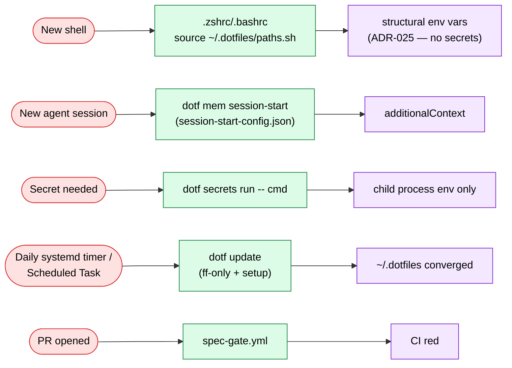

# Architecture — where does X live

> Normative map of this repository (CLI-002, issue #336). When the real tree and this doc
> disagree, one of them is a bug — `tests/architecture-md.bats` enforces that every real
> top-level directory is declared here. The cross-project "where does X live" reference
> (other repos, the vault's own layout) lives in the vault architecture map; this doc
> covers this repo — its tree (below) and its runtime data flow (§Runtime data flow),
> so orientation never depends on vault access.

## Top-level directories

| Directory | Purpose |
|---|---|
| `ai/` | Per-agent configuration sources (claude, opencode, copilot, pi, agy, hermes, nan) deployed by setup; thin overlays over the `AGENTS.md` SSOT |
| `cli/` | The `dotf` Go CLI — own module (`go.mod`), own release pipeline (goreleaser). See layout below |
| `docs/` | Build/operate knowledge: `adr/`, `runbooks/`, `troubleshooting/`, `lessons.md`, this file |
| `git-hooks/` | Global git hooks deployed via `core.hooksPath` (GUARD-001) — the memory-sink guard (`pre-commit`) plus per-type chain dispatchers that re-exec the repo-local `.git/hooks/<type>` so local guards (gitleaks) survive |
| `harness/` | Compiled harness records (skills, enforced overrides) — generated cache from the vault SSOT via `compile-harness.sh`; do not hand-edit |
| `powershell/` | PowerShell profile (Windows counterpart of `.zsh/`) |
| `scripts/` | Shell tooling as `.sh`/`.ps1` twins — **shrinking**: each twin is deleted when its logic ports to a `dotf` subcommand (ADR-020, epic #131); end state is thin bootstrap helpers only |
| `secrets/` | Secrets registry (`registry.yaml`) — the mapping SSOT (id → store source → env/file → consumers) read by `dotf secrets` (ADR-028) |
| `sensitive/` | age-encrypted secrets (`*.secret.age`); var mapping in `secrets/registry.yaml` |
| `specs/` | Active per-feature SDD specs; closed ones move to `specs/archive/` |
| `ssh/` | SSH client config + public key (deployed by setup) |
| `systemd/` | systemd user units (self-update + hive-upgrade timers, Linux) |
| `tests/` | bats (shell) + Pester (PowerShell) suites; structural guards (`agents-md.bats`, `architecture-md.bats`) |
| `windows/` | Windows-only assets without a Linux twin (e.g. `hive-upgrade.ps1`) |
| `.zsh/` | zsh config modules (aliases, functions, nvm) sourced by `.zshrc` |
| `.github/` | CI workflows (lint, test matrix, integration, cli, spec-gate, bitácora) |
| `.claude/` | Repo-local Claude Code settings |

## Root files

| File | Purpose |
|---|---|
| `AGENTS.md` | Cross-agent SSOT (system prompt); per-agent files delegate here |
| `setup-linux.sh` / `setup-windows.ps1` | Bootstrap entry points — the irreducible shell layer (ADR-020 C7) |
| `versions.conf` | Single source of truth for tool versions |
| `env-contract.json` | Environment variable contract shared by both setup paths |
| `packages.json` | Declarative cross-OS package catalog consumed by `dotf tools` (CLI-029) |
| `mcp-servers.json` / `session-start-config.json` | MCP registration + session-start manifests consumed by setup |
| `tmux.conf` | tmux configuration (Linux) |
| `CHANGELOG.md` | Generated by release-please (CLI-011) — not hand-edited per PR |

## `cli/` — standard Go CLI layout

Community-standard shape (go.dev module layout; same pattern as `gh` and `chezmoi`):

```text
cli/
├── cmd/dotf/
│   └── main.go          # entrypoint ONLY: version var (goreleaser ldflags) + cmd.New(version)
├── internal/
│   ├── cmd/             # Cobra wiring: one <verb>.go per subcommand (+ tests)
│   └── review/          # domain logic per subcommand family
├── go.mod               # own module — binary tags = releases, isolated from repo root
├── .goreleaser.yaml
└── README.md
```

Rules:

- `cmd/dotf/` never grows beyond `main.go` — the anti-flat-`scripts/` guard. `var version`
  stays there because goreleaser injects `-X main.version`; moving it breaks releases silently.
- Every future twin port lands as `internal/cmd/<verb>.go` + `internal/<domain>/`.
- The per-script migration map (which twin becomes which subcommand) lives in epic
  [#131](https://github.com/mlorentedev/dotfiles/issues/131) — single source, not duplicated here.

## Language boundary

Declared in **AGENTS.md §Language Boundary (this repo)** — Go owns user-facing tooling,
shell owns the thin bootstrap + profile/env, Python is not a layer (ADR-020). That section
is the SSOT; this doc only points to it.

## Runtime data flow

What triggers what, once setup has already deployed the repo. Corrects the pre-ADR-028
assumption that secrets populate the shell environment at login — they don't; secrets are
injected per-child-process, on demand, and everything else is either structural env vars
(no secrets) or an explicit `dotf` invocation.



## References

- [ADR-020](adr/adr-020-tooling-cli-go-convergence.md) — Go CLI convergence (drives this structure)
- [ADR-018](adr/adr-018-de-vault-task-placement.md) — task state lives in GitHub, not the vault
- [ADR-012](adr/adr-012-deploy-strategy-copy-with-drift-assertion.md) — deploy = copy + drift assertion
