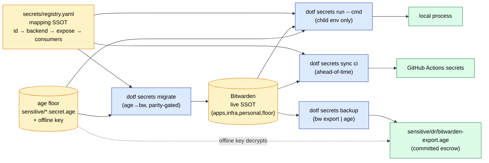

# Secrets Governance — Add / Rotate / Backup / Recover

> Operational protocols for the two-tier model in [ADR-028](../adr/adr-028-secrets-two-tier-bitwarden-age.md): **Bitwarden = live SSOT**, **age = DR escrow + bootstrap floor**, behind a `dotf secrets` facade + `secrets/registry.yaml`. As the model rolls out, the `dotf secrets` steps activate (Phase 1-2); until then the **manual `bw`/`age` equivalents** apply (marked _manual today_). Supersedes the age-only flow in `secrets-management.md`.

## Architecture at a glance



## Conventions (from ADR-028)

- Managed secrets live under **`{apps,infra,floor}`** in Bitwarden; the ~125 personal items are a separate tree, out of `dotf secrets`' bounds.
- The **registry** `secrets/registry.yaml` is the SSOT: `id → bw item/field → env|file → consumers → rotate`.
- **Values never render into an unintended channel** — a log, a chat/AI conversation, a shared terminal, CI output; **never `bw export` to plaintext on disk** (always pipe `--raw` into `age`). `dotf secrets show`/`run` are the deliberate, interactive-terminal-only exceptions this convention doesn't forbid — the rule is against accidental exposure, not against the primitives that exist specifically to show or use a value.

## Protocol — ADD a secret

When a new API key/token/credential enters the system:

1. Decide the **plane**: `app` (service key) / `infra` (access) / `personal` / `floor` (needed before bw — rare).
2. Create the Bitwarden item under `<plane>`, named `<service>-<purpose>` (kebab):
   - single value → item password; multi-value → custom fields (kebab names).
   - _manual today:_ `bw get template item | jq '.name="…" | .folderId="…" | …' | bw encode | bw create item`.
3. Add a **registry** entry: `{id, plane, backend: bw, bw:{folder,item,field}, expose:{env|file}, consumers, rotate}`.
4. Wire consumers (env-var contract / file target).
5. **Verify** it resolves without leaking: `dotf secrets run --only <id> -- printenv <VAR>` (never pipe the value anywhere shared).
6. **Do NOT** add it to `sensitive/*.age` — that path is retiring; the DR escrow already covers it.

## Protocol — ROTATE a secret

Scheduled cadence (registry `rotate`), suspected exposure, or offboarding:

1. **Map consumers first** (registry `consumers`) — rotation breaks them all at once. Per-purpose items keep the blast radius small (#321). **Never big-bang.**
2. Generate the new value (`bw generate -uln --length N` or the provider console).
3. Update the Bitwarden item (_manual today:_ `bw edit item <id> …`), then `bw sync`.
4. Roll consumers: `dotf secrets sync <target>` re-materializes CI/containers/agents; local picks it up on the next `run --`.
5. **Verify each consumer works, THEN revoke the old value** at the provider.
6. Refresh the DR escrow (below) so the new value is recoverable.

## Protocol — BACKUP / DR escrow

Scheduled (e.g. weekly) + before any big change:

1. **`dotf secrets backup`** — runs `bw sync` + `bw export --format json --raw`, pipes the plaintext **in memory** into `age` (encrypted to your own recipient, `age-keygen -y` of your identity), and writes `sensitive/dr/bitwarden-export.age` atomically (0600). The plaintext **never** touches disk; the artifact is decrypted back and **verified to round-trip** before the command succeeds (a corrupt escrow is removed, never left behind). Then **commit** it — it overwrites the previous export (git history is the version trail; no snapshot pile-up).
   - _Manual equivalent (no `dotf` on PATH):_ `bw sync && bw export --format json --raw | age -r "$(age-keygen -y ~/.config/age/key.txt)" -o sensitive/dr/bitwarden-export.age`.
2. **Mirror off-box** (#454, follow-up) and ensure the **age key has an OFFLINE authoritative copy** (#518: encrypted USB + paper/OS keychain) — it must NOT live only in Bitwarden (circular dependency).
3. The escrow covers the **entire** vault (API keys, tokens, logins, TOTP seeds) → losing Bitwarden is fully recoverable with the offline age key + a repo clone.

## Protocol — RECOVER (disaster)

Lost Bitwarden access / new machine / account compromise (the OPS-001 #257 chain):

1. **Restore the age key from its offline backup** → `~/.config/age/key.txt`. Everything below decrypts with this key, so nothing else in the chain can start until it is in place. The authoritative offline copy is an encrypted USB (VeraCrypt); `lsblk` identifies the device, which is not stable across machines.

   ```bash
   sudo apt install age veracrypt            # a fresh machine has neither
   veracrypt /dev/sdX1 /media/secrets        # prompts for the volume password
   install -m 600 -D /media/secrets/key.txt ~/.config/age/key.txt
   veracrypt -d /media/secrets               # unmount when done
   ```

   A USB written by `backup-secrets-to-usb.sh` also carries `ci-age-key.txt`, a standalone decrypt script and a `secrets/` mirror, so `cd /media/secrets && ./age-standalone.sh decrypt` recovers everything **without the repo**. A hand-copied USB holds `key.txt` alone — still enough for this chain, which is what matters here.

   Creating and refreshing that USB lives in [`secrets-management.md` § Physical Backup](secrets-management.md#physical-backup-usb--veracrypt). That runbook carries an out-of-date banner scoped to its `env-mapping.conf` workflow; the VeraCrypt procedure is **not** part of what was retired and remains current under ADR-028, which keeps age as the DR floor.
2. Clone the dotfiles repo.
3. `age -d -i ~/.config/age/key.txt sensitive/dr/bitwarden-export.age > $TMPDIR/vault.json` (ephemeral / tmpfs) — `sensitive/dr/bitwarden-export.age` is the artifact `dotf secrets backup` produced.
4. Stand up a fresh Bitwarden (or any manager) and **import** `vault.json` (`bw import bitwardenjson $TMPDIR/vault.json`); or read individual secrets for immediate needs.
5. Re-establish: `bw login` + unlock; `dotf secrets sync` to re-materialize consumers, then `dotf secrets verify` to confirm every registry secret resolves.
6. **Rotate** anything that may have been exposed during the incident.
7. Securely delete `$TMPDIR/vault.json`.
   - Account-independent: **age key (offline) + repo clone = full recovery**, even if the Bitwarden account is gone.

### Drill it

Run this chain against the real offline backup periodically — not as an incident,
as a rehearsal — then record it:

```sh
touch ~/.dotfiles/.dr-drill
```

`dotf doctor` reads that marker and warns when no drill is recorded, or when the
last one is over 180 days old. It cannot check the chain works; only running it
can. This runbook's step 1 had **no instructions at all** until someone ran it
(#848) — an escrow that exists proves a file was written, never that anyone can
restore from it.

## Maintainability (what keeps it from drifting)

- `dotf doctor` checks (target): `bw`/`age` present (#577); DR-export freshness; **registry ↔ vault consistency** (flag managed items — those in `apps`/`infra` — that break the naming/registry convention).
- All adds/rotations go through the **registry** — the single map. No ad-hoc env edits, no second authoritative copy.

## References

- [ADR-028](../adr/adr-028-secrets-two-tier-bitwarden-age.md) (decision + structure), `docs/secrets-inventory.md` (the map), [ADR-002](../adr/adr-002-age-over-gpg.md) (age).
- Tickets: #378, #493, #321, #518, #257, #454, #577.
