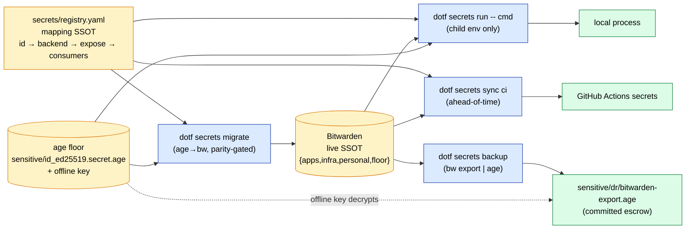

# Secrets Governance — Add / Rotate / Retire / Curate / Backup / Recover

> Operational protocols for the two-tier model in [ADR-028](../adr/adr-028-secrets-two-tier-bitwarden-age.md): **Bitwarden = live SSOT**, **age = DR escrow + bootstrap floor**, behind a `dotf secrets` facade + `secrets/registry.yaml`. This is the only secrets runbook. It absorbed `secrets-management.md` (#600); that file's still-current parts, the first-machine key and SSH setup and the offline USB copy, are below.

## Architecture at a glance


```mermaid
flowchart LR
    classDef store fill:#fef3c7,stroke:#d97706,color:#000
    classDef cmd fill:#dbeafe,stroke:#1e40af,color:#000
    classDef target fill:#dcfce7,stroke:#15803d,color:#000

    BW[("Bitwarden<br/>live SSOT<br/>{apps,infra,personal,floor}")]:::store
    AGE[("age floor<br/>sensitive/id_ed25519.secret.age<br/>+ offline key")]:::store
    REG["secrets/registry.yaml<br/>mapping SSOT<br/>id → backend → expose → consumers"]:::store

    RUN["dotf secrets run -- cmd<br/>(child env only)"]:::cmd
    SYNC["dotf secrets sync ci<br/>(ahead-of-time)"]:::cmd
    MIG["dotf secrets migrate<br/>(age→bw, parity-gated)"]:::cmd
    BAK["dotf secrets backup<br/>(bw export | age)"]:::cmd

    LOCAL["local process"]:::target
    CI["GitHub Actions secrets"]:::target
    DR["sensitive/dr/bitwarden-export.age<br/>(committed escrow)"]:::target

    REG --> RUN & SYNC & MIG
    BW --> RUN --> LOCAL
    AGE --> RUN
    BW --> SYNC --> CI
    AGE --> MIG --> BW
    BW --> BAK --> DR
    AGE -. "offline key decrypts" .-> DR
```

## Conventions (from ADR-028)

- Managed secrets live in the Bitwarden folders **`Dotfiles/apps`**, **`Dotfiles/infra`** and **`Dotfiles/personal`**, one per plane. Each is a single folder whose name contains a slash; Bitwarden has no real hierarchy. The ~160 personal items the registry does not declare are out of `reconcile`'s bounds. `dotf secrets curate` applies a reviewed plan to them (see CURATE below).
- **Folders by item kind, not by website type** (#1784):
  - `Dotfiles/*`: the registry's;
  - `Homelab`: the home lab's hosts, keys and service credentials;
  - `Dev`: developer accounts and API keys the registry does not declare;
  - `Cards`: payment cards;
  - `Identity`: documents and identities.

  A plain web login, banks and insurers included, stays unfoldered: search and autofill find it without a folder.
- **Hidden, not text,** for every custom field whose name marks a secret: key, token, secret, password, recovery or backup code. Identifiers stay text: account ids, buckets, endpoints, IBAN.
- **Reprompt on** for every item in `Homelab`, `Cards` and `Identity`, and for any item whose disclosure opens other accounts (the GitHub account, SSH keys). Reprompt is a gate in the Bitwarden apps. Whether `bw serve` reads through it has not been measured yet, so no registry-declared item gets reprompt until it is: after the first curate apply, `dotf secrets verify` must still resolve everything. A field's type does not matter to a read. `dotf secrets` resolves a hidden field exactly like a text one, and it writes new fields as hidden.
- **One authority per secret.** When another system owns a value (kubelab's SOPS, for example), the Bitwarden copy is removed once parity is measured equal.
- The **registry** `secrets/registry.yaml` is the SSOT: `id → bw item/field → env|file → consumers → rotate`.
- **Values never render into an unintended channel** — a log, a chat/AI conversation, a shared terminal, CI output; **never `bw export` to plaintext on disk** (always pipe `--raw` into `age`). `dotf secrets show`/`run` are the deliberate, interactive-terminal-only exceptions this convention doesn't forbid — the rule is against accidental exposure, not against the primitives that exist specifically to show or use a value.

## Protocol — FIRST MACHINE (age key + SSH)

These are the two secrets that must exist before Bitwarden is reachable. Both belong to the `floor` plane.

1. **The age identity** `~/.config/age/key.txt`. Every age-encrypted file in the repo is encrypted to it.
   - A machine that joins an existing setup restores the key from the offline USB (RECOVER, step 1).
   - Only a brand-new identity is generated. The floor and the escrow must then be re-encrypted to it.

   ```bash
   mkdir -p ~/.config/age && age-keygen -o ~/.config/age/key.txt && chmod 600 ~/.config/age/key.txt
   age-keygen -y ~/.config/age/key.txt   # the public recipient; AGE_KEY_PERSONAL declares it
   ```

   When the key is missing, `setup-linux.sh` and `setup-windows.ps1` warn and point to this section. To keep the key somewhere else, set `AGE_KEY_PATH`.
2. **The SSH key.**
   - The setup scripts deploy `ssh/config` and the public key.
   - The private key is the registry's `SSH_KEY` (`age-offline`, blob `sensitive/id_ed25519.secret.age`).
   - Resolving it materializes `~/.ssh/id_ed25519` with mode 0600, on Linux and on Windows:

   ```bash
   dotf secrets run --only SSH_KEY -- ssh -T git@github.com
   ```

## Protocol — ADD a secret

When a new API key/token/credential enters the system:

1. Decide the **plane**: `app` (service key) / `infra` (access) / `personal` / `floor` (needed before bw — rare).
2. Create the Bitwarden item under the folder for that plane, named `<service>-<purpose>` (kebab). The legal `bw.folder` values are **`Dotfiles/apps`**, **`Dotfiles/infra`** and **`Dotfiles/personal`** (`validBWFolders`), and each plane has exactly the one named after it (`planeFolder`). `floor` has no folder, and the registry refuses one: a floor secret's `bw:` block, when it has one, is a convenience copy of an authority kept elsewhere (`AGE_KEY_PERSONAL`).
   - single value → item password; multi-value → custom fields (kebab names).
   - `dotf secrets set <id> --yes` creates the item in its declared folder (value via stdin or hidden prompt).
3. Add a **registry** entry: `{id, plane, backend: bw, bw:{folder,item,field}, expose:{env|file}, consumers, rotate}`.
4. Wire consumers (env-var contract / file target).
5. **Verify** it resolves without leaking: `dotf secrets run --only <id> -- printenv <VAR>` (never pipe the value anywhere shared).
6. **Do NOT** add it to `sensitive/*.age` — that path is retiring; the DR escrow already covers it.

## Protocol — CONVERGE the store's layout

When the vault's shape disagrees with the registry — an item outside its folder, a
declared item that does not exist, a credential still living inside a shared item
(#321's split). Never fixed by hand in the app or web vault: the change is declared,
reviewed and applied.

1. **See the disagreement:** `dotf secrets drift` — folder, item and field findings,
   each ending `[<registry id>]`. Exits non-zero on any finding. Reads names only.
2. **Declare the target** in `secrets/registry.yaml`. Where the value must come from
   somewhere else — a field of a legacy item, or the same item under an old field
   name — declare the source:
   `bw: { item: github-cli-pat, field: GITHUB_PERSONAL_ACCESS_TOKEN, folder: Dotfiles/apps, from: { item: GitHub, field: "Personal Access Token" } }`.
3. **Plan:** `dotf secrets reconcile` prints `create-folder` / `move-item` /
   `create-item` / `add-field` / `retire-source` / `delete-item` and changes
   nothing. `blocked` lines name their remedy and make the plan unappliable;
   `deferred` lines belong to `dotf secrets migrate`. Every retire is compared at
   plan time and printed `verified equal`, or blocked with its verdict (`differs`,
   `destination empty`, `unreadable`). The plan reads the two values into memory to
   do that, and prints only the verdict.
4. **Apply** from the reviewed branch: `dotf secrets reconcile --apply`. It copies
   values inside the process (never printed), never overwrites an existing field,
   then syncs and re-plans. A re-plan that holds only retires gets one more pass
   (step 6); **anything else left fails the command**, and so does anything left
   after that pass. Without `retire:` every operation is additive, so an apply is
   safe before merge; a retire deletes the source field.
5. **Roll consumers** that are not local: `dotf secrets sync <target>`.
6. **Retire the source:** once consumers are verified on the copy, add `retire: true`
   to the `from:` and run reconcile again. It removes the source field only if the
   copy holds the **same** value (compared in memory, never printed); if they differ,
   one side was rotated and the plan blocks, naming the two ways out: rotate the
   declared secret to the source's value if the source is current, or drop
   `retire:` to keep both while it is settled. Never in the same *pass* as the copy: the
   comparison reads the copy from the store after a sync. So one `--apply` may run a
   second pass that holds only retires, which lets you declare `retire: true`
   together with the copy. It always runs after every other operation. One
   credential, one place — a search no longer returns two.
7. **Delete the record:** a satisfied `from:` (source retired, or no retire asked) is
   reported as removable — delete it in a follow-up.
8. **Retire an item:** an item that a retire left empty, or one whose registry
   entry was retired, is listed under the registry's top-level `retired:` with a
   reason. The registry refuses the entry while any declaration still names the
   item (drop the `from:` record first). The plan shows a `delete-item` line with
   what the item holds, by name only; `--apply` deletes it last, and Bitwarden keeps
   it in its trash for 30 days. Take a DR escrow (`dotf secrets backup`) before the
   apply. Once the plan reports the item gone, delete its `retired:` entry.
9. **Retire a dead field:** a legacy value that is dead rather than a copy (rotated,
   expired, answering 401) cannot pass step 6, because it equals nothing current.
   Prove it dead by consequence first, then list it under `retired:` with a
   `field:` and a reason: `{ item: Stripe, field: backup-codes, reason: ... }`. The
   item stays. The registry refuses `username`/`password` (an account's login) and
   any field a declaration still reads. The plan shows a `delete-field` line with
   what the item keeps. **A removed field does not go to the trash**: an edit is
   not a deletion, so the DR escrow taken before the apply is the only way back.
   Once the plan reports it gone, delete the entry.

## Protocol — CURATE the items the registry does not declare

Personal logins, cards and identities that no registry entry names. Filing,
de-duplicating and hardening them is not reconcile's job, and clicking through
the web vault leaves no review. The change is a plan, reviewed and then applied.

1. **Write the plan outside this repository.** Item names are personal, and this
   repository is public. The plan lives in the private knowledge vault. It is TSV,
   one row per operation: `op  target  arg  reason  [flags]`, keyed by item id or a
   unique id prefix. `dotf secrets curate --help` lists the eight operations and
   their flags.
2. **Plan:** `dotf secrets curate --plan <file>` syncs and prints one line per row,
   `apply`, `done` or `blocked` with its reason, and then a digest. It changes
   nothing. Output names ids, operations and states. It never names a value, a URI
   or an item.
3. **Resolve every `blocked` line.** A blocked line makes the whole plan
   unappliable. Most of them are the tool refusing a loss:
   - an item that carries a passkey is never written to;
   - a delete never touches an item with attachments;
   - a merge needs equal passwords, equal usernames (or `alias`), no TOTP on the
     duplicate, and a named `drop=` for whatever the keeper will not receive;
   - an item the registry declares only takes `hide` and `reprompt`.

   A `gate=<name>` line waits for something outside the vault, such as a key
   revoked at its provider. Pass `--cleared <name>` once that holds.
4. **Take a DR escrow first:** `dotf secrets backup`, then check that the escrow's
   item and passkey counts match the live vault. A removed field and a merged
   duplicate's notes are recoverable only from the escrow.
5. **Apply:** `dotf secrets curate --plan <file> --apply --digest <d>` with the
   digest the dry run printed. It refuses when the vault changed since that
   dry run. After applying, it re-plans and fails unless every row is `done`, and
   it fails if the vault's passkey count moved. Running it again plans nothing.
6. **Check by consequence:** `dotf secrets verify`, then open one reprompted item
   in the app.

## Protocol — ROTATE a secret

When it is due (the registry's `rotate`), when exposure is suspected, or at offboarding:

1. **Map the consumers first** (the registry's `consumers`). A rotation breaks all of them at once. Per-purpose items keep the blast radius small (#321). **Never rotate everything at once.**
2. Generate the new value at the provider.
3. **Rotate.** `dotf secrets rotate <id> --dry-run` shows the current value's fingerprint and writes nothing. Then run `printf %s "$new" | dotf secrets rotate <id>`, or omit the pipe to get a hidden prompt. The command:
   - refuses a new value equal to the current one;
   - writes the new value, syncs the daemon, and re-resolves it through the normal read path;
   - compares the fingerprints (sha256, never the value);
   - runs the entry's `validate:` liveness probe, if it declares one.

   The changed fingerprint is the proof. A probe alone cannot tell a rotated credential from an old one that was never revoked.
4. **Roll the consumers.** `dotf secrets sync <target>` re-materializes CI, containers and agents. A local process picks the new value up on its next `run --`.
5. **Check that each consumer works. Only then revoke the old value** at the provider.
6. **Refresh the DR escrow** (below), so that the new value is recoverable.

Rotation age: registry entries declare `rotate:`, but no code reads it yet (#1670), so nothing reports an overdue credential. Until #1670 ships, the QUARTERLY CHECK covers it.

## Protocol — RETIRE a secret

For a credential that is no longer used: a retired project, a closed account, or a copy whose authority lives somewhere else.

1. **Revoke it at the provider first.** Prove it is dead by consequence: the API answers 401, or the login fails. Deleting the vault copy does not revoke the credential. It only removes the record that the credential exists.
2. **Take a DR escrow** (`dotf secrets backup`). A removed field does not go to the trash.
3. **If the registry declares it:** remove its entry, and list the item (or its `field:`) under `retired:` in `secrets/registry.yaml`, with a reason. `dotf secrets reconcile --apply` then deletes it (CONVERGE, steps 8–9).
4. **If the registry does not declare it:** add a `delete` or `delete-field` row to a curate plan, with `gate=<provider>`. The row stays blocked until `--cleared <provider>` records that step 1 holds (see CURATE).
5. **Remove the retired key from `docs/secrets-inventory.md`,** so the map no longer lists it as live.

## Protocol — BACKUP / DR escrow

Scheduled (e.g. weekly) + before any big change:

1. **`dotf secrets backup`** — runs `bw sync` + `bw export --format json --raw`, pipes the plaintext **in memory** into `age` (encrypted to your own recipient, `age-keygen -y` of your identity), and writes `sensitive/dr/bitwarden-export.age` atomically (0600). The plaintext **never** touches disk; the artifact is decrypted back and **verified to round-trip** before the command succeeds (a corrupt escrow is removed, never left behind). Then **commit** it — it overwrites the previous export (git history is the version trail; no snapshot pile-up). `bw serve` has no export route, so the export needs the bw CLI's own session: on a terminal, `backup` prompts once for the master password and hands the session to its own `bw` children only (#1008). Unattended, prefix the run with `BW_SESSION="$(bw unlock --raw)"`, which also confines the session to that one process.
   - _Manual equivalent (no `dotf` on PATH):_ `bw sync && bw export --format json --raw | age -r "$(age-keygen -y ~/.config/age/key.txt)" -o sensitive/dr/bitwarden-export.age`.
2. **Refresh the offline copy** (see OFFLINE COPY below). The age key must have an authoritative copy offline (#518). If it lived only in Bitwarden, restoring Bitwarden would need the key it is supposed to restore.
3. The escrow covers the **entire** vault (API keys, tokens, logins, TOTP seeds) → losing Bitwarden is fully recoverable with the offline age key + a repo clone.

## Protocol — OFFLINE COPY (USB)

The offline DR copy is a USB stick formatted as one whole-disk VeraCrypt volume. It holds exactly three files (ADR-033 D2; this has been the state since 2026-09-26, #1000):

```text
<mount>/key.txt                          # the age identity
<mount>/secrets/dr/bitwarden-export.age  # the escrow
<mount>/secrets/dr/escrow-manifest.json  # its item count and digest
```

It never holds anything else:
- no plaintext;
- no per-secret blobs (CLI-036 retired them);
- no `ci-age-key.txt`, which is kubelab's CI identity (kubelab ADR-027).

**Do not run `scripts/backup-secrets-to-usb.sh`.** It copies the plaintext `sensitive/*.secret` files and the retired blobs, and it verifies nothing. #1770 replaces it with a `dotf` command that copies a declared payload and verifies it by consequence. Until that ships, refresh the copy after every escrow:

```bash
veracrypt /dev/sdX /media/veracrypt1       # lsblk names the device; it is not stable
install -m 600 -D sensitive/dr/bitwarden-export.age /media/veracrypt1/secrets/dr/bitwarden-export.age
install -m 600 sensitive/dr/escrow-manifest.json /media/veracrypt1/secrets/dr/escrow-manifest.json
# Verify by consequence. Only a recipient comparison and two counts are printed.
[ "$(age-keygen -y /media/veracrypt1/key.txt)" = "$(age-keygen -y ~/.config/age/key.txt)" ] && echo "recipient: same"
age -d -i /media/veracrypt1/key.txt /media/veracrypt1/secrets/dr/bitwarden-export.age | jq '.items | length'
jq .count /media/veracrypt1/secrets/dr/escrow-manifest.json      # must equal the line above
veracrypt -d /media/veracrypt1
```

**To create a new stick** (one time):
1. In the VeraCrypt Volume Creation Wizard, choose "Create a volume within a partition/drive", pick the whole device, and select AES and SHA-512.
2. Mount it, and run `install -m 600 ~/.config/age/key.txt <mount>/key.txt`.
3. Refresh it as above.

## Protocol — RECOVER (disaster)

Lost Bitwarden access / new machine / account compromise (the OPS-001 #257 chain):

1. **Restore the age key from its offline backup** → `~/.config/age/key.txt`. Everything below decrypts with this key, so nothing else in the chain can start until it is in place. The authoritative offline copy is an encrypted USB (VeraCrypt); `lsblk` identifies the device, which is not stable across machines.

   ```bash
   sudo apt install age veracrypt            # a fresh machine has neither
   veracrypt /dev/sdX /media/secrets         # prompts for the volume password
   install -m 600 -D /media/secrets/key.txt ~/.config/age/key.txt
   veracrypt -d /media/secrets               # unmount when done
   ```

   **Verify the key before trusting the rest of the chain.** A restored key that is
   the wrong one decrypts nothing, and finds out four steps later; one restored from
   a stale backup decrypts *some* things, which is worse. The public recipient is
   declared in `secrets/registry.yaml` on `AGE_KEY_PERSONAL` and is safe to read
   aloud — it is what someone uses to encrypt *to* this key:

   ```bash
   age-keygen -y ~/.config/age/key.txt      # must equal the `recipient:` in the registry
   dotf secrets verify                      # does the same comparison, plus the rest
   ```

   `verify` reports FAILED and names both strings when they differ (#1000 AC3). Before
   that check existed, a replaced or wrongly-restored root was indistinguishable from a
   healthy one until the day it was needed.

   The USB also holds the escrow and its manifest (see OFFLINE COPY). If no repo clone can be had, `/media/secrets/secrets/dr/bitwarden-export.age` can stand in for the copy that step 3 reads.
2. Clone the dotfiles repo.
3. `age -d -i ~/.config/age/key.txt sensitive/dr/bitwarden-export.age > $TMPDIR/vault.json` (ephemeral / tmpfs) — `sensitive/dr/bitwarden-export.age` is the artifact `dotf secrets backup` produced.
4. Stand up a fresh Bitwarden (or any manager) and **import** `vault.json` (`bw import bitwardenjson $TMPDIR/vault.json`); or read individual secrets for immediate needs.
5. Re-establish: `bw login` + unlock; `dotf secrets sync` to re-materialize consumers, then `dotf secrets verify` to confirm every registry secret resolves.
6. **Rotate** anything that may have been exposed during the incident.
7. Securely delete `$TMPDIR/vault.json`.
   - Account-independent: **age key (offline) + repo clone = full recovery**, even if the Bitwarden account is gone.

### Drill it

Run this chain against the real offline backup periodically — not as an incident,
as a rehearsal — then record it:

```sh
touch ~/.dotfiles/.dr-drill
```

`dotf doctor` reads that marker and warns when no drill is recorded, or when the
last one is over 180 days old. It cannot check the chain works; only running it
can. This runbook's step 1 had **no instructions at all** until someone ran it
(#848) — an escrow that exists proves a file was written, never that anyone can
restore from it.

## Protocol — QUARTERLY CHECK

Once a quarter, and after any large change, check that the vault still matches the conventions. Every check reads names and states, never values.

1. `dotf secrets drift` reports 0 findings, and `dotf secrets verify` reports every registry secret as OK.
2. **The undeclared items follow the conventions:**
   - every unfoldered item is a plain login;
   - secret-named fields are hidden;
   - reprompt is on in `Homelab`, `Cards` and `Identity`.

   `dotf secrets curate --check` will assert this (#1792). Until it ships, take a value-free inventory (ids, folders, field names and types) and write a curate plan for every violation.
3. **Bitwarden's Vault Health reports** (web vault → Reports) list exposed, reused and weak passwords, unsecured websites, and inactive two-step login. Each finding goes to ROTATE or RETIRE.
4. **Rotation age:** compare each entry's `rotate:` with the date of the item's last change (#1670), and ROTATE any that is overdue.
5. **The drill:** `dotf doctor` warns when the recorded DR drill (`~/.dotfiles/.dr-drill`) is more than 180 days old.

## Maintainability (what keeps it from drifting)

- `dotf doctor` checks: `bw`/`age` present (#577); DR-export freshness. **Registry ↔ vault consistency** is `dotf secrets drift` (CLI-078), and converging it is `dotf secrets reconcile` (CLI-080). The items it does not declare are curated from a reviewed plan with `dotf secrets curate` (SEC-006).
- All adds/rotations go through the **registry** — the single map. No ad-hoc env edits, no second authoritative copy.

## References

- [ADR-028](../adr/adr-028-secrets-two-tier-bitwarden-age.md) (decision + structure), `docs/secrets-inventory.md` (the map), [ADR-002](../adr/adr-002-age-over-gpg.md) (age).
- [Windows SSH Key Recovery](windows-ssh-key-recovery.md) (dedicated Windows host identity lifecycle).
- Tickets: #378, #493, #321, #518, #257, #454, #577, #600, #1670, #1770, #1784, #1792.
